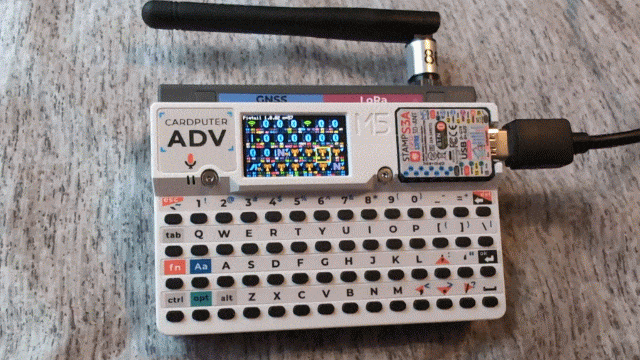
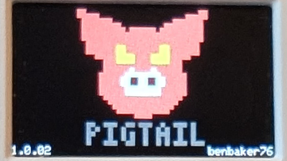
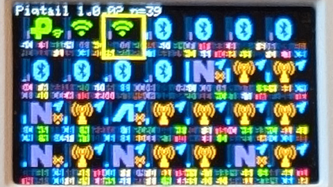
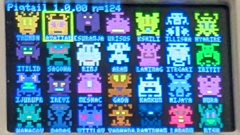
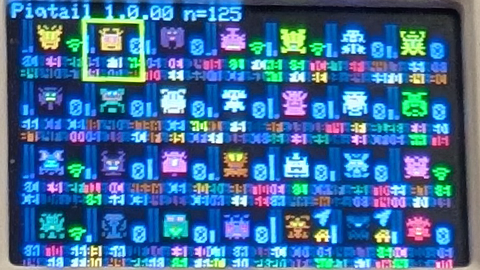

Pigtail is a tiny [Chasing-Your-Tail-NG](https://github.com/ArgeliusLabs/Chasing-Your-Tail-NG) proximity monitor for ESP32 that visualizes nearby wireless activity using icons, color, and retro-style avatars.

It passively observes **Wi-Fi** and **BLE** presence, tracks *how long* devices linger, and ranks them with a simple "suspicion / interest" score. Because MAC addresses are hard to mentally compare (hex bytes separated by `:` or `-`), Pigtail uses **distinct icons**, **consistent colors**, and **unique retro avatars** to help you recognize patterns over time at a glance.

---

## Why "Pigtail"?

This started as a [Chasing-Your-Tail-NG](https://github.com/ArgeliusLabs/Chasing-Your-Tail-NG) app-something that runs on an ESP32 and gives you a lightweight sense of what's around you. The name **Pigtail** is a nod to that idea, plus the small, portable nature of the device.

To add a personal spin, Pigtail integrates **RetroAvatars** (originally by Richard Phipps) with enhancements such as additional color support. RetroAvatars has always felt like it deserved a "real" project where the visuals matter-this was the perfect fit.

---

## What it does

Pigtail watches for:

- **Wi-Fi client activity** (e.g., probe requests)
- **Wi-Fi access points** (AP beacons / presence)
- **BLE advertisements** (nearby BLE devices)

It then:
- Tracks devices over time
- Estimates proximity trends using signal strength (**RSSI**)
- Assigns a score (0-100) based on how long and how consistently a device appears, plus some environment/crowd heuristics
- Presents everything in a compact UI designed for a **240x135** display

---

## Important note on privacy

Pigtail is designed to be **observational** and **non-identifying**:

- It does **not** attempt to identify individuals.
- Modern phones often use **MAC randomization / anti-tracking** techniques. That means the same physical device may appear under different addresses over time.
- What you typically get is "a device signature that seems to hang around" rather than a stable identity.

Use this responsibly and comply with local laws and venue policies. This project is intended for learning, visualization, and personal experimentation.

---

## Screenshots

---

## UI overview

### 1) Grid view (main view)
The main screen is a **7x4 grid** (28 slots) designed to fit exactly on a 240x135 display. Each visible slot represents one tracked entity (Wi-Fi client, BLE device, or AP).

The header shows:
- App name + version
- Current entity count (`n=...`)

**Key design goal:** the grid does *not* draw text over icons. Icons are rendered cleanly so you can compare devices quickly.

#### Grid icon modes
Press **Space** to cycle grid icon rendering modes (exact modes may vary by build, but typically include):

- **Large icon mode** (entity type emphasized)
- **RetroAvatar mode** (unique avatar emphasized)
- **Modes with small glyphs / MAC hints** (compact metadata without clutter)

Bars/indicators:
- **Bar 1** is driven by RSSI as a normalized value `0.0-1.0` (stronger signal → higher bar)
- **Bar 2** may be used for secondary metrics (e.g., score normalized to `0.0-1.0`)

#### Colors and quick recognition
Entity types use consistent accent colors so you can differentiate categories instantly. A typical mapping is:

- **BLE**: Blue
- **Wi-Fi client**: Green
- **Wi-Fi AP**: Orange

(These mappings are easy to adjust in code if you prefer different colors.)

---

### 2) Detail view
Selecting an entity opens a detail screen with:

- A small type icon (top-left)
- A generated "retro" name (top row, larger text)
- Text details below:
  - MAC address
  - RSSI
  - Score
  - Optional GPS/geo fields (if available in your build)

On the right side, the detail screen can show a large retro avatar for the selected entity, reinforcing recognition even when the MAC changes or is hard to remember.

---

## Controls (M5Cardputer keyboard)

Default navigation (as implemented in the current UIGrid input handling):

- **`,`** : left
- **`/`** : right
- **`;`** : up
- **`.`** : down
- **Enter** : open detail / confirm
- **Del / Esc** : go home / back
- **Esc** : reset (grid mode)
- **Space** : cycle grid icon mode

Navigation behavior:
- No wrap-around at the edges (left at start does nothing; right at end does nothing).
- Top/bottom bounds do not wrap to opposite edges.
- Scrolling occurs by rows when moving off the visible grid.

---

## How it works (high level)

Pigtail collects "observations" from wireless scanning sources and feeds them into a lightweight tracker:

- **Wi-Fi (promiscuous mgmt frames):**
  - Looks at management frames to observe client/AP presence.
- **Wi-Fi (scan results, optional depending on build):**
  - Can also use active scan results to discover APs and RSSI.
- **BLE (NimBLE scan):**
  - Captures BLE advertisement events with RSSI.

Entities are tracked in time windows:
- A device that appears consistently across windows becomes "more interesting"
- A device that appears briefly and vanishes is deprioritized

This is intentionally heuristic-based, because the goal is a *useful visualization* rather than a perfect classifier.

---

## Hardware

Designed for:
- **M5Stack Cardputer (ESP32)**  
- **240x135** display

---

## Roadmap ideas

Planned future improvements may include:
- More refined scoring heuristics / profiles
- Better handling of randomized addresses (pattern grouping experiments)
- Additional views (filters, grouping, timeline, history)
- Favorites and ignore lists
- Export/logging modes for offline review / KMS format for Google Maps
- More hardware support

---

## Credits

- [benbaker76](https://github.com/benbaker76) - Author & Maintainer
- Richard Phipps - Creator of RetroAvatars
